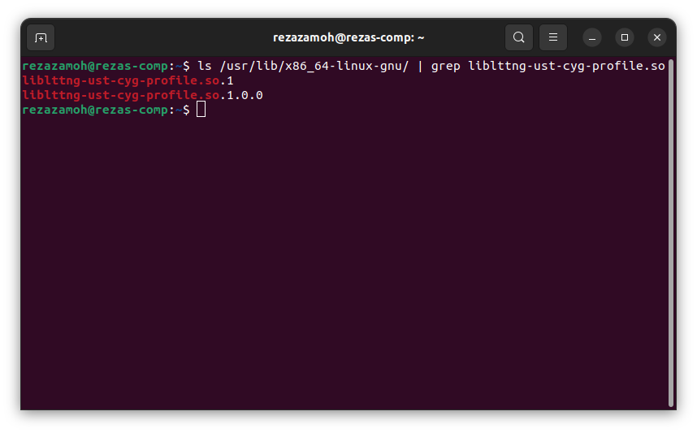
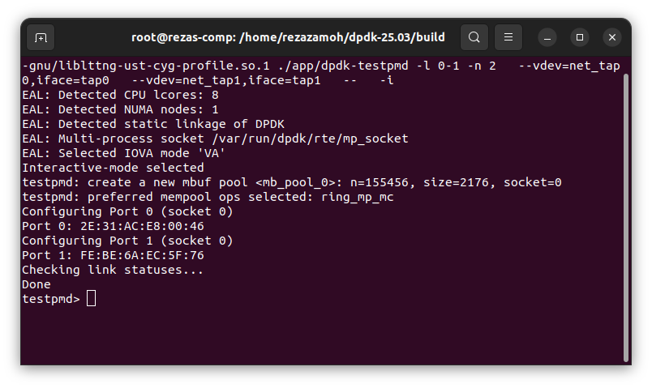
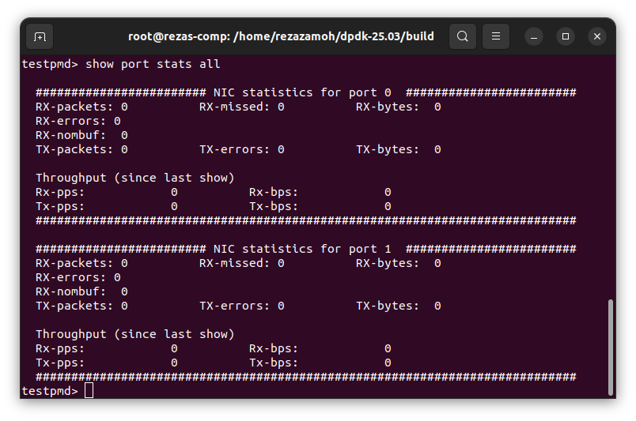
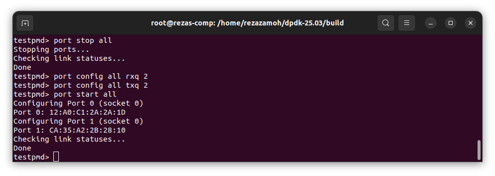
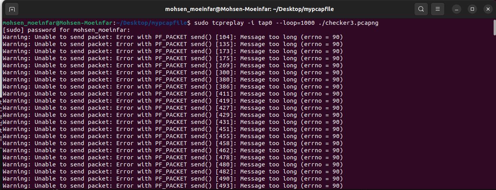
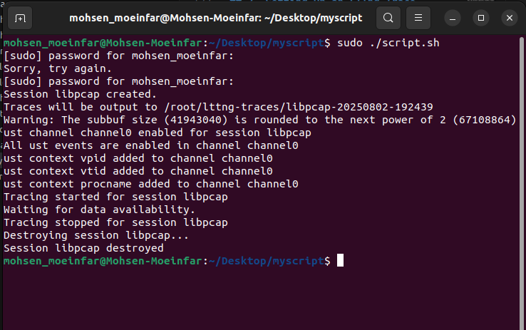
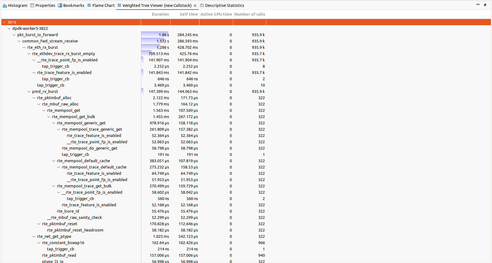

# Dpdk-TAP-Driver

This repository contains dpdk TAP driver and test-pmd application analysis with lttng tool and trace compass gui.

## System Specifications

The project was executed on the following system:

```bash
Architecture: x86_64
CPU op-mode(s): 32-bit, 64-bit
Byte Order: Little Endian
Address sizes: 39 bits physical, 48 bits virtual
CPU(s): 8
On-line CPU(s) list: 0-7
Thread(s) per core: 2
Core(s) per socket: 4
Socket(s): 1
NUMA node(s): 1
Vendor ID: GenuineIntel
Model name: Intel(R) Core(TM) i7-1065G7 CPU @ 1.30GHz
CPU min MHz: 400.000
CPU max MHz: 3900.0000
...
```

## Core Isolation

IRQs (both software and hardware) may cause context switches, degrading dpdk aplication performance. This Effect can be decreasesd by defining the rules for each CPU core but not fully deleted as dpdk does not fully bypass kernel.

```bash
sudo nano /etc/default/grub
```

Grub configuration file values should be changed to assign differnet jobs to different cores.

```bash
GRUB_CMDLINE_LINUX_DEFAULT="quiet splash isolcpus=4,5 nohz_full=4,5 rcu_nocbs=4,5 irqaffinity=0,1,2,3,6,7"
```

Value of `GRUB_CMDLINE_LINUX_DEFAULT` variable changes:

`isolcpus=4,5` isolates CPUs 4 and 5 from the general Linux scheduler.

`nohz_full=4,5` enables full tickless mode on CPUs 4 and 5.

`rcu_nocbs=4,5` offloads RCU (Read-Copy-Update) callbacks from CPUs 4 and 5.

`irqaffinity=0,1,2,3,6,7` restricts hardware interrupt handling to CPUs 0-3 and 6-7.

```bash
sudo update-grub
sudo reboot
```

`sudo update-grub` updates the grub bootloader configuration file and regenarates `/boot/grub/grub.cfg` file. Changes will finally take place after `sudo reboot` that can be assured by `dmesg | grep isolcpus`.


## 1. Installation and Build of DPDK

1. **Download the latest version from [the official website](https://core.dpdk.org/download/)**

<br>

 2. **Extract the Downloaded Archive**

    ```shell
    tar xJf dpdk-<version>.tar.xz
    cd dpdk-<version>
    ```

    <br>

 3. **Use Meson for Configuration of Build Environment**

    ```shell
    meson setup build \
    -Dexamples=all \
    -Dlibdir=lib \
    -Denable_trace_fp=true \
    -Dc_args="-finstrument-functions"
    ```

    <br>

 4. **Use Ninja for Build and Install**

    ```shell
    cd build
    ninja
    sudo meson install
    sudo ldconfig
    ```

     

    <br>

    You can validate the successful install by looking for compiled binaries in the /build/app directory.

    <br>

​		

## 2. Configure Hugepages

HugePages were allocated to provide large, contiguous memory pages for DPDK. A total of 1024 HugePages (2 GB) were configured.

```shell
sudo sysctl -w vm.nr_hugepages=1024
mount -t hugetlbfs none /dev/hugepages
```

> Note: With each system reboot you will need to configure Hugepages again, so it is recommended to make a bash file for this purpose.

<br>

## 3. Create two TAP interfaces for DPDK's TAP Poll Mode Driver (PMD)

Within the dpdk-<version>/build directory, execute the testpmd application using the following command:

```shell
sudo LD_PRELOAD=/usr/lib/x86_64-linux-gnu/liblttng-ust-cyg-profile.so.1 ./app/dpdk-testpmd -l 0-1 -n 2   --vdev=net_tap0,iface=tap0   --vdev=net_tap1,iface=tap1   --   -i
```

Command breakdown:

- `LD_PRELOAD=/usr/lib/x86_64-linux-gnu/liblttng-ust-cyg-profile.so.1`:
  forces the DPDK application to load LTTng's function tracing library first, enabling detailed profiling of function calls for performance analysis. This allows tracking exact timing and frequency of every function call in DPDK (like packet processing functions) to identify bottlenecks.
- `-l 0-1`:  Assigns 2 cores
- `-n 2   --vdev=net_tap0,iface=tap0   --vdev=net_tap1,iface=tap1`: 
  Creates 2 virtual devices named net_tap0 and net_tap1 with interfaces tap0 and tap1
- `-i`: Starts in interactive mode

You may run into some issues after running the code above depending on your kernel version because `liblttng-ust-cyg-profile.so.1` file my not be present. To determine which version is compatible with your system run the following command:

```shell
ls /usr/lib/x86_64-linux-gnu/ | grep liblttng-ust-cyg-profile.so
```

  You may see an output like this:

<br>

After executing the testpmd command you should see the following output:


## 4. Create Additional RX/TX Queues

Now, we will add a new queue while operating in TAP mode. However, let us retrieve relevant configuration details using the `show port stats all` and `show config fwd` commands.



By executing the command `show port stats all`, you will be able to view the statistics for all ports.


By executing the command `show config fwd`, you will see the output above. 
Let us break it down:

- `Forwarding Mode: io` -> This means packets received on a port are simply transmitted out through the corresponding transmit queue of another port.
- `Ports: 2` -> Two physical or virtual ports are active.
- `Cores: 1` -> One logical core (Core 5 in this case) is being used to process all forwarding tasks.
- `Streams: 2` -> Two forwarding streams are configured, each representing a receive/transmit (RX/TX) path between ports.
- `NUMA support: Enabled` -> The application is aware of NUMA (Non-Uniform Memory Access) node placement.
- `MP Allocation Mode: native` -> Memory pools are allocated in native DPDK mode.


For adding a new queue, we need to perform the following actions in testpmd:

- Stoping all ports: `port stop all`
- Creating new RX and TX queues: `port config all rxq 2` & `port config all txq 2`
- Start the ports again: `port start all`



After this step we can verify the added queues by running `show config fwd` once more:


## 5. Setting Up a Flow Filtering Rule in testpmd

You can direct specific traffic types to designated queues by creating a flow filtering rule in `testpmd` using the command below.

```shell
flow create 0 ingress pattern eth / ipv4 / udp / end actions queue index 0 / end
```

Upon successful execution, the output will look similar to this:  


This rule, applied to port 0, does the following:
- Detects all incoming UDP traffic flowing over Ethernet and IPv4.
- Directs the identified packets to RX queue 0.

### Managing Active Rules

To view active rules in `testpmd`, run:  
```shell
flow list 0
```
- `0` is the port number.  

 The output will appear similar to this: 

 

### Removing a Filter

To delete a filter in `testpmd`, use:  
```shell
flow destroy 0 rule 0
```
- The first `0` is the port, the second `0` is the rule number.

The output will appear similar to this:  

  


**Note:** In this scenario, we need the filter, so removal isn't necessary. However, if we need to trace traffic without filters and accidentally set one, this command can easily remove it.


## 6. Getting Started with tcpreplay

To begin, download the tcpreplay-4.5.1.tar.gz file from the TCP-Replay repository using this link: [TCP-Replay](https://github.com/appneta/tcpreplay/releases/tag/v4.5.1). This tool helps us send traffic to one of the interfaces we’ve created using testpmd. Once you have it, you’ll need to compile and install it on your system. After that, open a new terminal window and run these commands one by one:

```shell
./configure --disable-tuntap
make
sudo make install
```

**Important Tip:**  
You might run into issues compiling tcpreplay if you don’t have the right build tools, like make or automake. If that happens you can fix this by installing them with these commands:

```shell
sudo apt update
sudo apt install build-essential automake
```

### What Does tcpreplay Do?
tcpreplay replays captured network traffic (like pcap files) through a network interface to simulate real network activity. It's useful for simulating traffic scenarios.

### Running tcpreplay
After installing tcpreplay, you can use it to play a pcap file you’ve already created. Here’s the command to do that:

```shell
tcpreplay -i tap0 --loop=1000 ./Capture.pcap
```

- `-i tap0`: This tells tcpreplay to send the traffic through the `tap0` interface.
- `--loop=1000`: This makes it repeat the pcap file 1000 times, which is great for testing under repeated conditions.
- `./Capture.pcap`: This is the name of your pcap file that contains the captured traffic you want to replay.





**Note:**
If you don't have a `pcap` file to replay, you can capture network traffic using tools like `tcpdump` or `Wireshark`.

### Capturing Traffic with tcpdump:

To install `tcpdump` and capture network traffic, follow these steps:

1. Install `tcpdump`:

   ```shell
   sudo apt update
   sudo apt install tcpdump
   ```

2. Capture traffic from your main network interface :

   ```shell
   sudo tcpdump -i wlp3s0 -w Capture.pcap
   ```

   This command will capture traffic from  wireless interface (`wlp3s0`) and save it in the `Capture.pcap` file. You can stop the capture by pressing `Ctrl+C` when you're done.

### Capturing Traffic with Wireshark:

Wireshark is a graphical tool for capturing and analyzing network traffic. You can download and install Wireshark from the official website here: [Wireshark Download](https://www.wireshark.org/).

1. Install Wireshark:

   ```shell
   sudo apt update
   sudo apt install wireshark
   ```

2. Launch Wireshark and start capturing on your desired network interface. Once you've captured the traffic, save it as a `pcap` file, and you can use that file with `tcpreplay`.


After that, in the ‍‍`testpmd` terminal, just type `start`, and then run `show port stats all` to see the traffic on the TAP interface.


<br><br>


## 7. Setting Up an LTTng Trace Session

To automate the LTTng capture process, you'll need to create a shell script that configures the LTTng session. This script will set up the session, enable the necessary context, start tracing, pause for a defined period, and then stop and clean up the session.

1. First, create a new script file and make it executable:

    ```shell
    touch script.sh
    chmod +x script.sh
    nano script.sh
    ```

2. Now, paste the following commands into your script:

    ```shell
    #!/bin/bash
    lttng create libpcap
    lttng enable-channel --userspace --num-subbuf=4 --subbuf-size=40M channel0
    #lttng enable-channel --userspace channel0
    lttng enable-event --channel channel0 --userspace --all
    lttng add-context --channel channel0 --userspace --type=vpid --type=vtid --type=procname
    lttng start
    sleep 2
    lttng stop
    lttng destroy
    ```


### Understanding the Script:


1. **Initialize the LTTng Session:**

   ```shell
   lttng create libpcap
   ```

   * Creates a new trace session named `libpcap`.

2. **Enable a Trace Channel:**

   ```shell
   lttng enable-channel --userspace --num-subbuf=4 --subbuf-size=40M channel0
   ```

   * Sets up a userspace channel (`channel0`) with 4 subbuffers, each 40MB in size, to store trace data.

4. **Enable All Trace Events:**

   ```shell
   lttng enable-event --channel channel0 --userspace --all
   ```

   * Enables all userspace events on `channel0` to be traced.

5. **Add Context Information:**

   ```shell
   lttng add-context --channel channel0 --userspace --type=vpid --type=vtid --type=procname
   ```

   * Adds context information such as the process ID (vpid), thread ID (vtid), and process name to the trace.

6. **Start the Trace:**

   ```shell
   lttng start
   ```

   * Starts the tracing session.

7. **Pause the Script:**

   ```shell
   sleep 2
   ```

   * Pauses the script for 2 seconds to allow some events to be captured.

8. **Stop and Clean Up:**

   ```shell
   lttng stop
   lttng destroy
   ```

   * Stops the trace and destroys the session, cleaning up any resources used.


### Running the Script


Once `tcpreplay` is running and generating traffic, you can execute the script by running the following command:

```shell
sudo ./script.sh
```

This will start the LTTng trace session, capturing the relevant events while `tcpreplay` continues to generate traffic.




### Viewing the Trace Results

After running the script, the trace results will be saved in the following directory:

```
/root/lttng-traces/
```

To analyze the results, you can open the trace with **Trace Compass**, a graphical tool for visualizing traces.


# Tracing Analysis - UDP Filtering

13 milion Events captured with 887 nanosecond average standard deviation. Optimization rule increased events captured by 11.0% and decreased average of standard deviation by 88.6%.

## Alternative Density Shift

Event density drops to zero when context switch happens for lcore 5 without regrads to the function that is being called, it should wait for another switch to load dpdk-worker5 application variables. It is worthy to point out pmd_rx_burst helper chain contains more events against pmd_tx_bursts' that will cause sigmoid dense shift while their call stack is conversed.

> ▸ _As specified OS uses CFS (Completely Fair Scheduling) that works based on priority scheduling, it is more probable for some threads that are being ran with lower priority will experince more context switches (the reason of high standard deviation for several functions or huge self time/duration in flame graph) for instance: `rte_net_get_ptype`, `pmd_rx_burst`, `pmd_tx_burst`_

---


<br>

## Hot Code Paths

| Function                        | ratio | Responsibility                           |
| ------------------------------- |-------| ---------------------------------------- |
| rte_net_get_ptype               | 52.8% | Determine packet type by parsing headers |
| rte_ethdev_trace_rx_burst_empty | 60.0% | Trace an empty RX burst (0 packets)      |
| pmd_rx_burst                    | 97.7% | Poll RX queue and fetch received packets |

> ▸ _These paths can be found via functions with two layers upper towards `tap_trigger_cb` (can be called at last layer of call stack because of its event driven nature) that have bigger ratio of self time over duration than others._

---



<br>

## Practical mitigation options

| Mitigation                     | Applicable Context        | Implementation                                     |
| ------------------------------ | ------------------------- | -------------------------------------------------- |
| Process priority surge         | networking environments   | nice() or setpriority() to change process priority |
| CPU core isolation             | deterministic performance | At boot time, isolate core via kernel parameters   |
| Pre-slice traffic in generator | Synthetic workload        | Send UDP frames to a dedicated TAP.                |

> ▸ _The fourth core is dedicated for running app and 5 to 7 are in charge of forwarding packets, but only core 5 was used.This can be increased as described in [Intel Manual](https://www.bing.com/ck/a?!&&p=133bafcb2e934382baeacdda3640a23fc7aff520198bc1d12ebcd43320968603JmltdHM9MTc1MzkyMDAwMA&ptn=3&ver=2&hsh=4&fclid=1272d906-47db-60ab-2561-cd0446d26150&psq=dpdk+bad+througput&u=a1aHR0cHM6Ly93d3cuaW50ZWwuY29tL2NvbnRlbnQvZGFtL2RldmVsb3AvZXh0ZXJuYWwvdXMvZW4vZG9jdW1lbnRzL3Rlc3RpbmctZHBkay1wZXJmb3JtYW5jZS1hbmQtZmVhdHVyZXMtd2l0aC10ZXN0cG1kLTcyMTA5MC5wZGY&ntb=1)._

---

<br>

## Context Switch

Another trace was done with both kernel and userspace involved to prove the idea that was discussed earlier.

> ▸ _interrupt and followed context switches of core 5 causes delay in dpdk-worker5 functions and causes the thread to wait for CPU cycles._

---


<br>

## Throughput

Each `tap_trigger_cb` means a frame is received  from NIC (tap driver) causing `rte_pktmbuf_alloc`, `rte_net_get_ptype` subroutine activation per each frame. The worst case happens when tap trigger is called on dpdk/worker5 directly.

> ▸ _Processing 8 packets took 176.3 microseconds (12 nanoseconds of wasted time between `pkt_burst_io_forward` calls is negligible) concluding application is capable of receiving and sending 5672 packets per second. Assuming mtu is set to 1500 as default the maximum forwarding would be 8.5 gigabyte per second. VPP makes great difference becuase of linear rate packet processing (larger packets mean higher throughput)._

---


<br>

## Receiving Helper Chain

`pmd_rx_burst` is called whenever `tap_trigger_cb` interrupt occurs. Within one burst there could be different calls of `rte_pktmbuf_alloc` with `rte_net_get_ptype` followed which matches the number of frames received on tap driver. 

> ▸ _Flame chart includes `rte_constant_bswap16` calls inside ptype function but source code does not include this function. Actually they are called via `rte_cpu_to_be16`. This routine is neccessary becuase CPU byte order (little Endian as specified) differs from Network byte order._

---


<br>

## Flow Rule Impact

Without flow rules set on testpmd, Events captured decreases by 24.2% (other settings as the same). Average standard deviation is 2.1 microseconds while average runtime of functions is 1.2 microseconds, proving less CPU cycle intensity as expected. 

> ▸ _Hot code paths are remaining the same with their almost previous ratio except for `pmd_rx_burst` with 73.8%. `tap_trigger_cb` is called 4291 times totally (refer to Descriptive Statistics) and 4100 times (refer to Weighted Tree Viewer new Callstack) is happened on 4 other threads of dpdk (testpmd, intr, mp-msg, telemet), meaning 4.4% of tap triggers happened in dpdk-worker which needs less context switches._

---

<br>

## Challenges and Solutions

### 1. Missing Meson Module

* **Issue**: Encountering No module named 'mesonbuild.machinefile' in running `meson install` after `ninja` command.

* **Solution**: uninstall all meson versions that are installed with pip or apt and their relative libraries in usr/ folder, then install it with root priviledges (not as a superuser) by pip.
  
  ```bash
  sudo pip install meson
  ```

* **Outcome**: meson successfully installs the compiled artifacts.

### 2. Empty Trace Folder

* **Issue**: After running lttng script, the ust folder of trace is empty.
* **Solution**: Clean install lttng stable ppa version with [LTTng Stable 2.13 PPA installation Guide](https://lttng.org/docs/v2.13/#doc-ubuntu-ppa) 
* **Outcome**: Trace has captured preloaded fuctions.

### 3. Null Trace Compass Views

* **Issue**: Call stack views ( Flame Graph & Flame Graph Selection) are empty.

* **Solution**: install java-21 and set as deafult version of java.
  
  ```bash
  sudo apt install openjdk-21-jdk -y
  ```

* **Outcome**: Call stack gets visible (still needs sometime based on host ram and CPU).

### 4. Incomplete Symbol Mapping

* **Issue**: some functions are available only by their address not their names.
* **Solution**: click on symbol mapping button shown below (available for flame chart, flame graph, ...) then check `Use custom target root directory` without choosing any directory and press ok.

  

* **Outcome**: Function names  will be loaded completely for each window that is opened afterwards.
